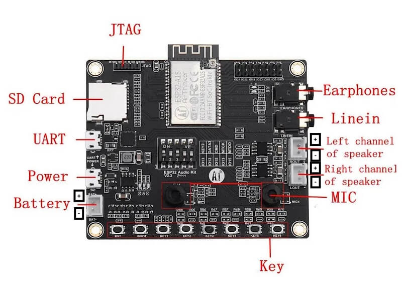

# esp32-bluetooth-speaker
Build your own 3D Printed ESP32 Bluetooth Speaker

This is a simple design for 3D printing and building your own rechargeable Bluetooth speaker based on the ESP32-Audio-Kit developer board. There are multiple firmware options for the ESP32-A1S developer board, including ESPHome and Squeezelite-ESP32. I chose Squeezelite for its bluetooth and Lyrion Music Server connectivity, as well as support for Spotify Connect and AirPlay. With LMS you can stream your personal music library, or choose from plugins for Spotify, Tidal, Soundcloud, and much more. LMS also gives you the ability to stream to multiple devices syncronously, and with precision latency. The design included in this repo is for the most basic, portable design with two speakers (up to 5 watt per channel at 4 ohms), two 18650 Lithium Ion batteries with USB-C charging, and of course, the ESP32-Audio-Kit with built-in amplifier and exposed buttons. STEP files are also included, so you can modify this design for other supported features of the ESP32-A1S and Squeezelite-ESP32, including a TFT screen, rotary encoder, RGB LED strip (vu-meter), aux in, and line out. 

Check out this video to see my fleet of speakers in action, synced together with LMS. 

[](https://www.youtube.com/watch?v=jyw16yoPHqg)

## Credits

This work is based on a few open source projects and design contributions from throughout the maker community. 

- [squeezelite-esp32]([https://github.com/sle118/squeezelite-esp32?tab=readme-ov-file]) - The ESP32 firmware that makes this all possible! 
- [EdwardKrayer's ESP32-A1S_Squeezebox_Case](https://github.com/EdwardKrayer/ESP32-A1S_Squeezebox_Case) - The files contained in this repo were built off of this design.

## Materials

You will need the following materials to complete this project:

- [ESP32-Audio-Kit Developer Board](https://diyelectromusic.com/2025/04/07/esp32-a1s-audio-kit/)
- [diymore 18650 Lithium-Ion Battery Shield](https://www.diymore.cc/collections/battery-shield/products/18650-16340-lithium-battery-shield-v9-v8-v3-mobile-power-expansion-board-module-5v-3a-3v-micro-usb-type-c-for-arduino-esp8266?variant=31588973707335)
- 2X 18650 Lithium-Ion button top batteries ([Preferably 9800-10000mAh](https://www.google.com/search?q=18650+9900mah+lithium+ion+battery))
- 3D Printer filament of your choice, PLA or PETG used in examples. 
- 2X [2" 4Ohm 5 watt Full Range Speakers](https://www.amazon.com/DWEII-Speaker-Loudspeaker-Compatible-Arduino/dp/B0CH89VKK3?th=1)
- 3X [JST XH 2.54mm pitch 2-pin electronic computer connector IC male plugs](https://www.jst.com/products/crimp-style-connectors-wire-to-board-type/xh-connector/) or [pre-crimped connectors with wires](https://www.amazon.com/dp/B0DFH1N4H6?ref_=ppx_hzsearch_conn_dt_b_fed_asin_title_6&th=1)
- ~120cm 22ga stranded wire (if self-crimping)
- 12X (ruthex RX-M3x5.7 threaded inserts)[https://www.ruthex.de/en/products/ruthex-gewindeeinsatz-m3-100-stuck-rx-m3x5-7-messing-gewindebuchsen]
- 12X [M3x6mm hex socket head cap screws](https://www.mcmaster.com/91290A111/)
- 8X [M3x10mm hex socket head cap screws](https://www.mcmaster.com/91290A115/)
- 4X [M3x12mm hex socket head cap screws](https://www.mcmaster.com/91290A117/)
- 8X [M3 hex nuts](https://www.mcmaster.com/90592A085/)
- 8X [M3 hex washers](https://www.mcmaster.com/98269A420/)
- [Self-adhesive rubber strips for shock absorbtion](https://www.amazon.com/s?k=self-adhesive+rubber+strip)
- USB-C charger and cable. Minimum 2 amps, but 5 or more is recommended.

## Recommended Tools

- Soldering iron, solder, and flux
- 2.5mm hex screwdriver (Or whatever tool you need for the type of screw cap you use)
- M3 nut driver and/or needle nose pliers
- [PA-09 JST crimping tool](https://www.adafruit.com/product/350?srsltid=AfmBOoptPi8FYWA-7s8cKBnXNS4IoNQylDs4XngL9c6RnNxk61b_cTp7)
- wire cutter/stripper
- 3D Printer (minimum 220x100x100mm build area)
- Micro-USB serial cable (USB-A or USB-C both work, as long as the host machine supports them)

## 3D Printing

- 1x [body](./STL/body.stl)
- 1x [speaker panel](./STL/speaker-panel.stl)
- 1x [panel cover](./STL/panel-cover.stl)
- 2x [speaker grill](./STL/speaker-grill.stl)

---
**NOTES**

McMaster Carr links/part numbers listed for common, recommended fastners, but the type or material you use is not important. Be mindful of the thread type (M3 0.5mm pitch) if using the recommended ruthex threaded inserts. 

Button-top lithium ion batteries are recommended, as they provide built-in protection circuits and fit better with the spring-type contacts of the diymore battery shield. Ultmiately, if it fits it sits, so if you have 18650 batteries laying around and want to use them, try them out and see if they fit. 

PETG filament is strong and somewhat flexible, and has a high melting point. This is typically the same type of plastic found in soda bottles. PLA is strong, but brittle, and typically gets the best layer adhesion in a 3D printer. Whatevery you choose, try not to abuse, drop, or throw the case. The components inside are susceptible to breaking and cannot withstand a lot of impact.

The self-adhesive rubber strips are optional, and there is flexibility on both the size and shape. Mine has two rubber strips, about 12mm wide and 1.5mm thick. You can use button-style, circle, square, rectangle strips, or whatever you like. The grip of the rubber provides both stability and shock absorbtion for your device.

The JST XH 2.54mm pitch 2-pin conectors are one of many types, shapes, and sizes of JST connectors. You do need to get the right ones to make this work. Don't just buy any 2-pin JST connector.

[A good crimp is a beautfiul thing](https://iotexpert.com/jst-connector-crimping-insanity/). It is a skill that electronics builders like me develop over time, and invest a lot in tools. Consider buying pre-crimped wires if you are not confident. If you are eager to learn and practice, buy a lot of connectors and make extras! Get a good set of crimping pliers (PA-09 is my favorite) and keep your crimp hand strong!

**Supports**

For the main body, you may need supports inside the USB-C opening, if your printer is drooping the small overhang. Other than that, this piece mostly prints as-is with good bed adhesion.

For the speaker panel, you will need supports for the speaker cavities. In most slicers, "touching the build plate" should work fine, but if you can paint on supports, you can avoid unnecessary supports on the angled sides.

For the panel cover, no supports are needed, and it has good bed adhesion.

For the speaker grills it is highly recommended to use a 0.4mm nozzle, as that is the thickness of the honeycomb grill. 

I used a 0.2mm layer height for all parts. The design is suitable to this layer height.

---

## Preparation

Before you begin, prepare your build by cutting, stripping, crimping, and soldering your wires. 

You will need 2x pairs of wires at ~20cm for the speakers. Begin by crimping the JST male connectors on one end of the pair, and solder the wires to the contacts of each speaker. Polarity mostly doesn't matter, unless you have fixed-polarity speakers that are labeled `+` and `-`. If so, check the JST polarity configuration on the board before soldering the wires to the speakers. Another common configuration of speaker contacts has one small and one large spade-style contacts. Negative goes on the large contact.

You will need a third pair of wires at ~20cm for the power cable. This is intended to be fairly long so that the panel has enough slack during assembly. Crimp the JST connector on one end, and mind the polarity. Solder the wires into one of the 5V pairs on the back of the diymore battery shield. IMO, this is the best and most stable way to do this, however, there is a very tight space to use a short USB-A to Micro-USB cable (~3"). You may need an angle adapter or a very slimline Micro-USB plug because of the lack of clearance next to the speaker, but the JST connector pair is probably the way to go since you will need them for the speakers anyways.

Finally, install the inserts in the battery cradle of the body and the sides of the speaker panel. The best way to use threaded inserts is to place them in the holes, and heat them up with a soldering iron, while gently pushing them into the plastic. Make sure to let them cool before screwing anything into them. The top of the insert should be slightly below the surface to avoid shorting the grounds on the battery shield.

****Do not assemble anything yet, make sure all preparation and 3D printing is finished before moving on to the next step.** 

## Flashing the firmware

I have been using this [browser-based tool to flash my ESP32-Audio-Kit boards](https://sle118.github.io/squeezelite-esp32-installer/). You will need to connect the ESP32-Audio-Kit board to a USB port on the host machine before you begin. Some operating systems may require a driver for the UART data port. If your ESP32 is not recognized by your browser, it will show some recommendations for installing a driver. Choose the `CH341` UART chip driver in that case. 

## WiFi Setup and Configuration

You can use the same computer that you used to flash the firmware to setup WiFi and access on the Squeezelite dashboard. Once the firmware is finished loading and it reboots, you will be able to connect to it via WiFi by selecting the `squeezelite-xxxx` SSID in the available WiFi networks, and the password is `squeezelite`. Once connected, browse to http://192.168.4.1 and setup your WiFi connection. Squeezelite will automatically scan for WiFi connections and setup is fairly straightforward. When you are successfully connected to WiFi in Squeezelite, you can disconnect from the device's WiFi and re-connect to your network. 

Once WiFi is enabled and working in Squeezelite, and you are re-connected to the same WiFi network as the device, you should be able to pull the Squeezelite dashboard up by browsing to http://squeezelite-xxxx.local. The hostname of the device can be found under the System tab, but it will also be the same as the WiFi SSID you initially connected to in the last step. If your browser does not support local hostname discovery, you will need to dig for the IP address. This can be found in the dashboard while connected to the device's WiFi, but it can also be found in your router's DHCP device list. For example, the assigned address may be http://192.168.0.101. 

Now that Squeezelite is connected to WiFi and you have found the dashboard, there are few configuration changes to make:

- If you want to change the hostname, especially if you plan to have more than one device on the same network, that can be done in the System tab under `New Name`. 
- Go to the `Hardware` tab and under `Known Board Name` select `ESP32A1S V2.2+ Variant 1 (ES8388)`. Save, Apply, Reboot.
- The first time you use Squeezelite it should be in recovery mode and the `NVS Editor` tab should be visible at the top of the dashboard. If not, goto the `Credits` tab and select `Show NVS Editor`. 
- Browse to the `NVS Editor Tab and enter the following configurations:
  - Under `actlrs_config` type `buttons`
  - Scroll to the bottom and create a new key, and call it `buttons`
  - Give `buttons` the following JSON string: 
```json
[{"gpio": 18,"type": "BUTTON_LOW","pull": true,"long_press": 600,"debounce": 0,"normal": {"pressed": "BCTRLS_PS5"},"longpress":{"pressed":"BCTRLS_UP"}},{"gpio": 5,"type": "BUTTON_LOW","pull": true,"long_press": 600,"debounce": 0,"normal": {"pressed": "BCTRLS_PS6"},"longpress":{"pressed":"BCTRLS_DOWN"}},{"gpio": 36,"type": "BUTTON_LOW","pull": true,"long_press": 600,"debounce": 0,"normal": {"pressed": "BCTRLS_PS1"},"longpress":{"pressed":"BCTRLS_LEFT"}},{"gpio": 13,"type": "BUTTON_LOW","pull": true,"long_press": 600,"debounce": 0,"normal": {"pressed": "BCTRLS_PS2"},"longpress":{"pressed":"BCTRLS_RIGHT"}},{"gpio": 19,"type": "BUTTON_LOW","pull": true,"long_press": 600,"debounce": 0,"normal": {"pressed": "BCTRLS_PS3"},"longpress":{"pressed":"KNOB_LEFT"}},{"gpio": 23,"type": "BUTTON_LOW","pull": true,"long_press": 600,"debounce": 0,"normal": {"pressed": "BCTRLS_PS4"},"longpress":{"pressed":"KNOB_RIGHT"}}]
```
  - Scroll to the bottom of the screen and click `Commit` and then find the `Exit Recovery` button in the footer and click that. Squeezelite will reboot and it's ready to go! 

## Assembly

- First install the battery shield into the battery crade of the body. Make sure to line up the button and the USB-C port with the windows on the back of the body before screwing it in. 
---
**IMPORTANT** 

Do not tighten the screws too tight. Ideally, they should not be torqued at all, just lightly fastened to the inserts until they touch the circuit board, without leaving a gap between the circuit board and the surface. This has caused me a bit of grief, because over-tightening the battery shield will cause it to smoke when the batteries are inserted, and burns out one of the microchips on the bottom of the board. This bricks the battery shield. It's a nice device otherwise. Once it has been lightly fastened it will not need to be adjusted or interfered with again. 

---

- Next, attach the speakers and grills to the speaker panel. The grills should go on top, with four M3x10mm screws each, through the panel, and into the speakers. Put a washer and nut on each screw and use an M3 nut driver or pair of needle-nose pliers to hold the nut while tightening the screws. Using M3 lock washers is also perfectly fine. Secure these screws tight to the panel and ensure there is no loose attachments that can vibrate. There should be enough room in the speaker cavities to get your fingers inside to attach the washers and nuts to the screws from behind. 
- Next, insert the ESP32-Audio-Kit board onto the pegs in the top cavity of the speaker panel. In my case, there wasn't much tolerance, so I had to line up all four pegs with the holes in the circuit board before pressing down.
- Guide the wires through the right side of the top cavity and plug in the JST connectors for both speakers, and the 5V power source. These are all labeled on the board, but here is a reference in case you have trouble reading it:

- Ensure that the switch on the front of the battery shield is in the `on` position and press the button on the back of the body once. If everything is connected correctly, you should be able to connect to it as a bluetooth device and start testing the sound. Make sure both speakers are working before advancing to the final steps. Once you are satisfied that everything is working correctly, press the button on the back twice to turn the power off. 
- Insert the speaker panel into the body at a 45 degree angle until the holes on the sides of the body line up with the threaded inserts in the spaker panel. There are four M3x8mm screws on each side. I recommend screwing them in loosely until all holes are lined up and all screws have been started before tightenting them. 
- Place the panel cover over the top cavity. The cover will have four protruding, hollow pillars that will slide over the pegs that are holding the board in place. Once this is lined up correctly, you should be able to push the cover into the pegs until it is flush with the panel.
- Finally, use the four M3x12mm screws to secure the cover to the panel. Do not force or push the screws into these holes, they should self-tap.

## Get Started

Your homemade DIY Bluetooth speaker is ready to test!

- Charge the batteries with a USB-C charger through the USB-C port on the back. 
- On the bottom of the device, there is a small window which shows the charging progress. There are 5 LEDs, and one of them will continue to blink until both batteries are fully charged. 
- Press the power button on the back once to power on the device. 
- Connect a Bluetooth audio source to the device and test your sound. Once again, make sure that both speakers are working and they are properly balanced. If one speaker is quieter than the other or either speaker is not working, there is likely a weak connection somewhere that needs to be fixed. 
- Press the power button twice to turn the device off. 

## Final Notes

Once the device is working and configured properly, it is a great time to start exploring the features of Squeezelite. Use the dashboard to make any configuration tweaks that are needed. If all you need is a Bluetooth speaker, this project is plug-n-play and ready to go, and you may never require connecting to the dashboard again.